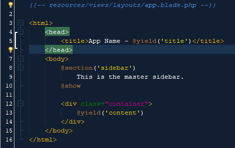
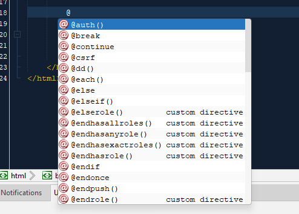
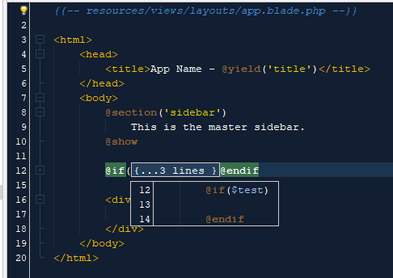
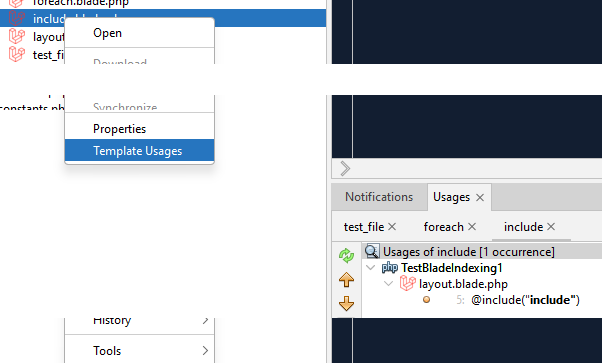

# Netbeans Php blade editor

Netbeans Php blade editor using Antlr Lexer and Parser.

> [!NOTE]
> This is an extract of a new netbeans modules suite : [https://github.com/haidubogdan/nb-18-php-blade-plugin](https://github.com/haidubogdan/nb-18-php-blade-plugin) still in development.

Installation
============

## Requirements
[]() []()

Installing from package
----------------------


The plugin is not uploaded on netbeans site as it is still in experimental version.

Check for relase versions at : https://github.com/haidubogdan/netbeans-php-blade-plugin/tags

1. In Netbeans open Tools -> Plugins, select Downloaded tab.
2. Click "Add plugins" and select the downloaded nbm.
3. Select the checkbox next to the "Blade for Netbeans" plugin and click Install.
4. Restart the IDE when demanded and enjoy your new plugin.

Installing from source
----------------------

1. Clone the git repository.
2. Start a new Netbeans project, choose NetBeans module as project type.
3. Setup your project.
4. Right-click on project name and choose Create NBM.
5. Install the NBM file as described in "Installing from package".

For more information refer yourself to: http://platform.netbeans.org/tutorials/nbm-google.html

## Github actions

- releases and nbm artifact upload can be done with github action also

## Usage

### Features

- Blade syntax coloring



- Declaration finder for 
    - php elements
    - included paths
    - yield ids (section)
    - stack elements
- Php code completion inside expressions, and echo tags



- Brace matcher and folding



- Find template usage (only in the blade files context)



**Custom directives**

Project -> Properties -> Laravel Blade -> Custom Directives

Just add the php file where you added the custom directive implementation as in [https://laravel.com/docs/10.x/blade#extending-blade](https://laravel.com/docs/10.x/blade#extending-blade).

**VIews folder**

If you use **blade templates** outside of the generic laravel framework or have custom templates folders you can configure them for a project.

This will help the yielid and view path completion

**Reformat and indentation**

Experimental formatting and indenting

**blade components**

Limited completion and declaration finder

---

### Known issues

> [!WARNING]
> .

**brace matcher**

- Emoji character can break brace matching.

**completion**

- lag, when changing between projects, or on idle after indexing has finished

**formatting**

- some indentation are broken from netbeans core HTML plugin

ex: a basic html file

```
<table>
    <tr>
        <th>Col</th>
    </tr>
    <tr>
        <td><a href="">{cursor}</a></td>
    </tr>
</table>
```

after enter from cursor position

```
<table>
    <tr>
        <th>Col</th>
    </tr>
    <tr>
                <td><a href="">
            
            </a></td>
    </tr>
</table>
```

**php code validation**

- embedded php code doesn't have syntax error warning

### Why Netbeans 18+ requirement ?

The plugin is implemented using **ANTLR** lexer and parser. I migrated from **Jflex** and **jcup** tools due to scalability reason.
Antlr plugin was introduced with Netbeans 18.

### Still missing

Some features are not implemented in this plugin version : 

- variable completion from controller
- components completion and declaration finder
- error diagnostics for inline php code
